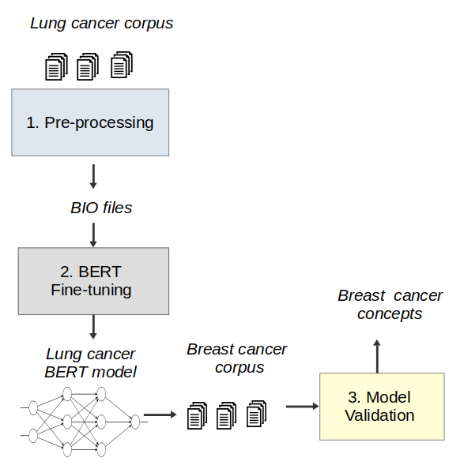

# Breast Cancer Diagnosis
Deep learning to extract Breast Cancer diagnosis concepts

This repository contains code about  a proposal to extract breast cancer diagnosis concepts using  <strong>BERT</strong> models trained on an extrarnal corpus  corpus (lung cancer). We show the possibility of applying deep learning-based models to predict cancer concepts in a different dataset to the one they were trained on.  

This proposal is based on <strong>transfer learning</strong> techique. Figure 1 describes the proposal in this repository.

The cancer datasets used in this study contains clinial notes from patients treated with lung and breast cancer.  These datasets are affected by General Data Protection Regulation (GDPR) and is available only "upon request". These dataset can be accessible after an evaluation by the hospital's ethics committee.   

More information, please write to oswaldo.solartep@alumnos.upm.es

  

 
