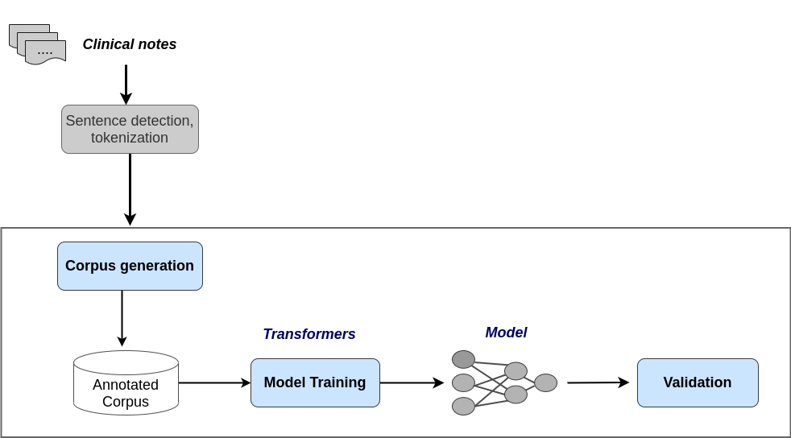

# Transformers for Extracting Breast Cancer Information 

This repository contains code for extracting breast cancer information using  <strong>Transformers</strong> models. We show the possibility of applying deep learning-based models to extract cancer named entities from Spanish clinical narrativas. A breast cancer corpus has been developed to support clinial named entity recognition.  

This proposal is based on <strong>transfer learning</strong> techique. Figure 1 describes the proposal in this repository.

The cancer datasets used in this study contains clinial notes from patients treated with breast cancer.  These datasets are affected by General Data Protection Regulation (GDPR) and are available only "upon request". These dataset can be accessible after an evaluation by the hospital's ethics committee.   

More information, please write to oswaldo.solartep@alumnos.upm.es

  

   

## Code description

This stats are generated with [Spacy](https://spacy.io/) NLP Python Library.

In [k-fold folder](./k-fold/) you can find the code to performing a K-fold validation.

